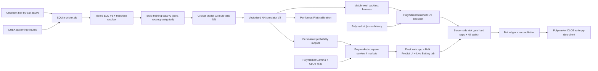

# Cricket Match Predictor — Polymarket Edge Engine

A calibrated cricket match simulator built around a multi-task neural network
(V2) and a Polygon CLOB write-path for placing edge bets and (eventually)
providing liquidity on thin Polymarket cricket sub-markets. Supports T20 and
ODI for both men's and women's cricket. Active focus: Polymarket. Other
exchange integrations are deferred indefinitely (see
[`docs/NEXT_OVERHAUL.md`](docs/NEXT_OVERHAUL.md)).

## What this is

- **Cricket simulator (V2)**: ball-by-ball Monte Carlo over a multi-task
  neural network with learned player/venue/team embeddings, hierarchical
  per-over budget biasing, 9-class outcomes including extras, and per-(format,
  gender) Platt calibration.
- **Polymarket compare service**: links each upcoming cricket fixture to the
  matching Polymarket event and surfaces model edge across all 4 modellable
  cricket markets (Moneyline, Team Top Batter, Most Sixes, Toss Match Double).
- **Guarded write-path** (Wave 5 in progress): semi-auto live betting with
  hard caps, kill switch, bet ledger, and a graduating $200 -> $1000
  envelope.

## Quickstart

```bash
git clone https://github.com/yourusername/cricket-match-predictor.git
cd cricket-match-predictor

# Apple Silicon (recommended) — Python 3.11 + Metal GPU
./scripts/setup_apple_silicon.sh
source venv311/bin/activate

# Or generic Linux/Intel
python -m venv venv && source venv/bin/activate && pip install -r requirements.txt

playwright install chromium
cp .env.example .env

# Build database + ELO + V2 model (one-shot operator runbook below)

python app/main.py
```

Visit `http://localhost:5001` and use:

- `/predict` — single-match Monte Carlo
- `/bulk-predict` — fixture grid with Polymarket compare cards
- `/team-explorer` — franchise unification + duplicate cleanup
- `/rankings` — tiered ELO leaderboards
- `/training` — model versions and data ingestion
- `/live-betting` — Wave 5 Phase 6d (will appear once Phase 6 ships)

## Architecture



## What we model on Polymarket

| Market | Outcomes | Modellable | Source signal |
|---|---|---|---|
| Moneyline | 2-way | Yes | V2 simulator's natural output (`team1_win_prob`, calibrated) |
| Team Top Batter | 3-way (team1 / draw / team2) | Yes | New per-batter run distribution from V2 sim |
| Most Sixes | 3-way (team1 / draw / team2) | Yes | New per-team six counter from V2 sim |
| Toss Match Double | 4-way (toss x match) | Yes | Cross-product: model moneyline x 50% toss |
| Toss Winner | 2-way | No | Genuinely 50/50; no edge |
| Completed Match | 2-way (yes/no) | No | Weather event, not cricket-skill |

Headline V2 metrics on the 44-match IPL 2025 holdout (vs always-50/50):

| Metric | V2 | 50/50 baseline |
|---|---|---|
| Brier score | 0.252 | 0.250 |
| Log loss | 0.696 | 0.693 |
| MAE total runs | 29.62 | n/a |

V2 is essentially at the calibration floor (50/50 NLL = 0.693). The headline:
on IPL match-winner alone, T20 cricket is genuinely hard to beat — the value
shows up on side markets (Top Batter, Most Sixes) and on per-fixture EV
across hundreds of bets, which is what Wave 5 measures.

## Setup

```bash
cp .env.example .env
```

`.env` is gitignored. Required for live runs:

| Variable | Required for | Notes |
|---|---|---|
| `SECRET_KEY` | Flask sessions | Any random string |
| `CRICKET_DATA_API_KEY` | Cricket Data fallback | Optional |
| `POLYMARKET_*` | Read-path | Public read works without keys; write needs L2 creds (set up in Wave 5 Phase 6a) |
| `POLYGON_PRIVATE_KEY` | Write-path | Wave 5 Phase 6a; set after running `bootstrap_polymarket_wallet.py` |
| `BETTING_*` | Write-path | Hard caps + mode + kill switch; defaults are conservative |

Betfair env vars are kept but flagged Deferred — leave blank.

## Operator runbook

End-to-end from a fresh checkout:

```bash
# 1. Download + ingest Cricsheet data
python -m src.data.downloader
python -m src.data.ingest

# 2. Calculate ELO ratings (tiered V3 + V4 franchise unification)
python scripts/backfill_franchises.py            # Idempotent IPL franchise rebrands
python scripts/dedupe_elo_history.py             # Backup + recalc + UNIQUE-index install (~5 min)

# 3. Build V2 training data (joint, both genders, both formats)
python scripts/build_ball_training_v2.py --gender both

# 4. Train V2 with the Wave 4.5 winning recipe (~30-40 min)
python scripts/train_cricket_model_v2.py \
    --epochs 50 --batch-size 4096 --vocab-min-count 5 \
    --early-stopping-patience 5 \
    --class-weight-mode uniform --over-loss-weight 0.1 \
    --hidden-units 512 --n-hidden-layers 3 \
    --embedding-dim-batter 32 --embedding-dim-venue 24 --embedding-dim-team 12 \
    --label v2_overnight

# 5. Backtest V2 on a holdout
python scripts/backtest_simulator.py --model-version v2 \
    --tournament-pattern '%Indian Premier League%' \
    --since-date 2025-01-01 --limit 50 --n-sims 500 --label v2_ipl_2025

# 6. Fit calibration on the backtest CSV
python scripts/fit_calibration.py \
    --backtest-csv data/backtest/backtest_v2_ipl_2025.csv \
    --output data/models/v2/calibration.json

# 7. A/B compare V2 against the V1 baseline
python scripts/compare_backtests.py \
    --baseline data/backtest/backtest_baseline_ipl_2025_summary.json \
    --candidate data/backtest/backtest_v2_ipl_2025_summary.json

# 8. Run the web app
python app/main.py
```

After any Team Explorer merge, re-run `python scripts/dedupe_elo_history.py --skip-backup`
so ELOs recompute under the new groupings.

### Wave 5 Phase 5 — Polymarket historical EV backtest (when ready)

```bash
python scripts/backtest_polymarket_ev.py \
    --tournament-pattern '%Indian Premier League%' \
    --since-date 2024-06-01 \
    --edge-thresholds 3,5,10 \
    --bet-size 25 \
    --output data/diagnostics/wave_5_polymarket_ev.md
```

### Wave 5 Phase 6 — Polymarket write-path bootstrap (when ready)

```bash
# 1. Generate a dedicated Polygon wallet (one-time)
python scripts/bootstrap_polymarket_wallet.py --generate

# 2. Fund printed wallet address with USDC on Polygon (~$200)
# 3. Run on-chain approvals + derive L2 API creds
python scripts/bootstrap_polymarket_wallet.py --approve

# 4. Add printed POLYGON_PRIVATE_KEY + POLYMARKET_API_* to .env
# 5. Restart Flask, navigate to /live-betting; mode defaults to OFF
```

## Daily startup (after reboot / Cursor restart)

Three processes need to be running for live trading to operate:

```bash
cd /Users/darcy5d/Desktop/DD_AI_models/indias_dad

# 1. Flask web app (port 5001) — dashboard + API
FLASK_PORT=5001 venv311/bin/python -m flask --app app.main run --port 5001 --host 127.0.0.1

# 2. Post-toss daemon — detects toss, spawns paper+live scans, executes TWAP plans
venv311/bin/python scripts/paper_bet_auto_post_toss.py \
    --poll-interval 90 --lookback-min 45 --lookahead-min 30 --also-live

# 3. Cron jobs (already installed, verify with `crontab -l`):
#    :00 — paper_bet_daily.py (paper trade scanner, hourly)
#    :30 — live_bet_scan.py (live trade scanner with TWAP routing, hourly)
```

### Quick start (copy-paste)

Run Flask and the daemon as background processes:

```bash
cd /Users/darcy5d/Desktop/DD_AI_models/indias_dad

# Start daemon (backgrounded, logs to logs/paper_auto_post_toss.log)
nohup venv311/bin/python scripts/paper_bet_auto_post_toss.py \
    --poll-interval 90 --lookback-min 45 --lookahead-min 30 --also-live \
    >> logs/paper_auto_post_toss.log 2>&1 &

# Start Flask (backgrounded, logs to logs/flask.log)
FLASK_PORT=5001 nohup venv311/bin/python -m flask --app app.main run \
    --port 5001 --host 127.0.0.1 >> logs/flask.log 2>&1 &
```

### Health checks

```bash
# Daemon alive?
cat logs/paper_auto_post_toss_status.json | python3 -m json.tool | head -5

# Flask alive?
curl -s http://127.0.0.1:5001/api/betting/config | python3 -m json.tool | head -3

# Cron installed?
crontab -l | grep -E "(paper_bet|live_bet)"

# Active TWAP plans?
sqlite3 cricket.db "SELECT plan_id, fixture_key, status, chunks_placed, chunks_filled FROM order_plans WHERE status IN ('pending','executing');"
```

### Troubleshooting

| Symptom | Cause | Fix |
|---------|-------|-----|
| Flask hangs on startup (>30s) | TensorFlow rebuilding .pyc cache after pip changes | Wait 60s for first startup; subsequent starts are fast |
| Daemon won't start ("already running") | Stale PID file | `rm logs/paper_auto_post_toss.pid` then restart |
| Port 5001 in use | Old Flask process | `lsof -ti :5001 \| xargs kill -9` then restart |
| `py-clob-client-v2` import error | Package uninstalled | `venv311/bin/pip install py-clob-client-v2` |
| Playwright not found | Binary missing | `venv311/bin/python -m playwright install chromium` |

### Process architecture

```
┌─────────────────────────────────────────────────────────┐
│ Cron (:00)  paper_bet_daily.py    → paper bets to DB    │
│ Cron (:30)  live_bet_scan.py      → FOK or TWAP plans   │
│                                                         │
│ Daemon (90s) paper_bet_auto_post_toss.py                │
│   ├─ Detect toss → spawn paper + live post-toss scans  │
│   └─ Process TWAP plans → place/check limit orders     │
│                                                         │
│ Flask (:5001) app/main.py                               │
│   └─ Dashboard, API, reconciliation                    │
└─────────────────────────────────────────────────────────┘
```

### TWAP execution (Wave 5.9)

The live bet scanner routes orders based on order-book spread:
- **Spread ≤ 5pp** → instant FOK (fill-or-kill) market order
- **Spread > 5pp** → TWAP plan written to `order_plans` table; daemon places limit order chunks every 90s up to `max_acceptable_price = model_prob - min_edge_pp/100`

Config in `.env`:
```
TWAP_FOK_THRESHOLD_PP=5    # spread threshold for FOK vs TWAP routing
TWAP_PRICE_STEP_PP=2       # default price step (overridden dynamically per plan)
```

## Data model

Schema files live in [`src/data/`](src/data/):

- `schema.sql` — base matches/teams/players/deliveries
- `schema_v2.sql` — phase + outcome columns
- `schema_v3_tiered_elo.sql` — tiered team ELO + cross-pool normalisation
- `schema_v4_franchise.sql` — `team_groups`, `team_external_ids`, franchise unification
- `schema_v5_betting.sql` — `bet_ledger` (Wave 5 Phase 6b)
- `schema_v6_paper_betting.sql` — paper-bet columns + indices
- `schema_v7_twap.sql` — `order_plans`, `order_chunks` (Wave 5.9 TWAP execution)
- `schema_model_versions.sql` — `model_versions`, training metadata

See [`docs/DATABASE_SCHEMA.md`](docs/DATABASE_SCHEMA.md) for the full
column-level reference.

## Project journey

[`docs/NEXT_OVERHAUL.md`](docs/NEXT_OVERHAUL.md) holds the running wave-by-wave
backlog and history. Headline waves:

| Wave | Theme | Status |
|---|---|---|
| 1 | CREX scraper hardening + venue tooling | Done |
| 2 | Polymarket read path + Bulk Predict UI | Done |
| 3 | Team franchise unification + ELO data repair | Done |
| 3.5 | Match-level backtest harness | Done |
| 4 | Cricket Model V2 strategic rewrite | Done |
| 4.5 | V2 score-MAE fix (V2 now beats V1 on every metric) | Done |
| **5** | **Multi-market simulator + Polymarket compare + guarded write-path** | **Current** |
| 6 | Polymarket liquidity provision (LP) | Parking lot |
| 7 | V2 productionisation (GUI integration, debug UI, etc.) | Parking lot |
| 8 | Advanced model + new data sources | Parking lot |

## Tech stack

| Component | Technology |
|---|---|
| ML framework | TensorFlow / Keras (Metal GPU on Apple Silicon) |
| Python | 3.11 (required for Metal GPU) |
| Backend | Python, Flask |
| Database | SQLite |
| Historical cricket data | Cricsheet.org (16,700+ men's, 3,900+ women's matches) |
| Live fixtures | CREX (primary), ESPN Cricinfo (fallback) |
| Polymarket SDK | `py-clob-client` (Wave 5 Phase 6a) |
| Wallet chain | Polygon (chain_id 137) |
| Frontend | HTML / CSS / vanilla JS |
| Web scraping | Playwright (dynamic), BeautifulSoup (static) |

## Performance

| Setup | Sims/sec | 10k sims | 50k sims |
|---|---|---|---|
| M2 Pro + Metal GPU | ~400-600 | ~20s | ~1.5 min |
| M2 Pro CPU only | ~100-150 | ~80s | ~7 min |
| Intel Mac | ~60-80 | ~2 min | ~10 min |

Verify GPU is active:

```python
import tensorflow as tf
print(tf.config.list_physical_devices('GPU'))
```

## Running tests

```bash
pytest tests/
```

Notable suites:

- `tests/test_simulator_v2_extras.py` — V2 hierarchical sampling + extras handling
- `tests/test_calibration.py` — per-format Platt scaling
- `tests/test_player_batting_elo_actual.py` — Wave 3 player batting ELO formula

## Inspiration

This project was inspired by Andrew Kuo's pioneering work on
[ball-by-ball T20 cricket prediction using Monte Carlo simulation](https://towardsdatascience.com/predicting-t20-cricket-matches-with-a-ball-simulation-model-1e9cae5dea22/).
Kuo achieved 55.6% match prediction accuracy on 3,651 T20 matches, demonstrating
both the power of probabilistic simulation and the inherent unpredictability of
T20 cricket. His ~25% top-batter accuracy reference is the bar we benchmark V2
against in Wave 5 Phase 4.

## License

MIT License

## Acknowledgments

- Cricsheet.org for comprehensive cricket data
- ESPN Cricinfo and CREX for live match schedules and squads
- Andrew Kuo for the original ball-by-ball simulation methodology
- Polymarket for an accessible CLOB API and a willing market for cricket signal
